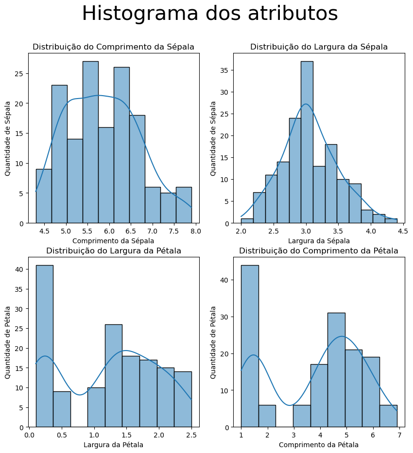
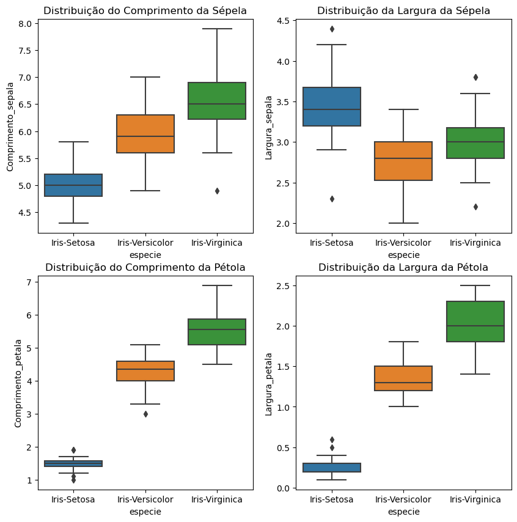
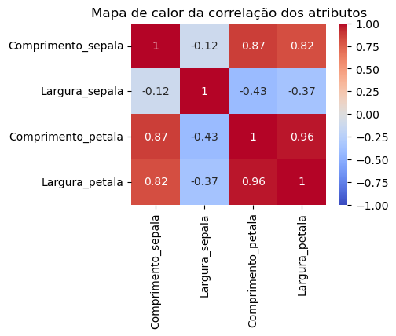
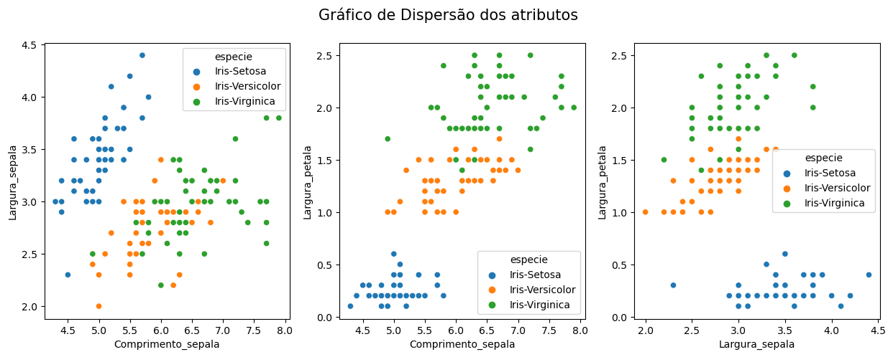

# Análise descritiva: dase de dados Íris

A base de dados possui 150 amostras distribuidas igualmente entre as três classes que se refere ao tipo de planta íris. O conjunto de dados foi retirado do artigo de Fisher.
As classes estão dispostas da segiunte maneira:
| Classe           | Rótulo |
|------------------|--------|
| Iris-Setosa      |   0    |
| Iris-Versicolor  |   1    |
| Iris-Virginica   |   2    |

Já os atributos que compõem a base de dados são dados por:
| Característica              | Unidade de Medida |
|-----------------------------|-------------------|
| Comprimento da sépala       |        cm         |
| Largura da sépala           |        cm         |
| Comprimento da pétala       |        cm         |
| Largura da pétala           |        cm         |

## Medidas de Têndencia Central
Para mediar o grau de concentração dos dados é utilizado para cada atributos a visualização das distrubuições das amostras por meio do 
- Histograma 
- Diagrama de Caixas

### Histograma 

    
   
  <em>Figura 1: Histograma dos atributos</em>

### Diagrama de Caixas

    
   
  <em>Figura 2: Diagrama de Caixas da largura e comprimento da Sélepa e Pétola</em>

A partir da distribuição de diagrama de caixa é possível perceber que o atributo Largura da Sépela possui uma faixa de outliers.

### Correlação dos Atributos

    
   
  <em>Figura 3: Correlação dos atributos</em>

Atráves da matriz de correlação é possível observar que os atributos Comprimento da sépala e Largura da sépala são bem descorrelacionados. 

### Dispersão dos Atributos

    
   
  <em>Figura 4: Dispersão dos atributos largura e comprimento da Sélepa e Pétola</em>

